### Project-2 Documentation

## Step 1

*Download updates for ubuntu*

`sudo apt update`

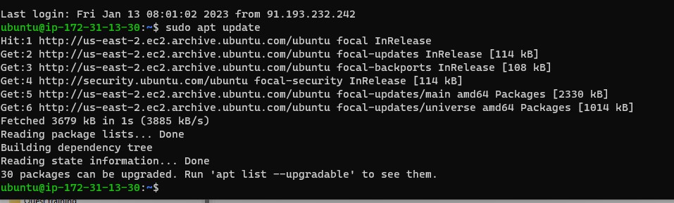

*Install ngnix*

`sudo apt install ngnix`

*Verify that nginx was successfully installed*

`sudo systemctl status nginx`

*Check ubuntu locally*

`curl http://127.0.0.1:80`

*Check on the browser with the public ip address*

`http://<Public-IP-Address>:80`

## Step 2

*Install MySql*

`sudo apt install mysql-server`

*Log in to the MySQL console*

`sudo mysql`

*Define the root user's password*

`ALTER USER 'root'@'localhost' IDENTIFIED WITH mysql_native_password BY 'PassWord.1';`

*Start the interactive script by running and validate password plugin*

`sudo mysql_secure_installation`

*Test MySQL login to console*

## Step 3

*Install PHP PHP fastCGI process manager and PHP-MySQL*

`sudo apt install php-fpm php-mysql`

## Step 4 CONFIGURING NGINX TO USE PHP PROCESSOR

*Create the root web directory for your_domain*
*Assign ownership of the directory with the $USER environment variable*
*open a new configuration file in Nginx’s sites-available*

`sudo mkdir /var/www/projectLEMP`
`sudo chown -R $USER:$USER /var/www/projectLEMP`
`sudo nano /etc/nginx/sites-available/projectLEMP`

*Paste in the following bare-bones configuration*

*Activate your configuration by linking to the config file from Nginx’s sites-enabled directory*

`sudo ln -s /etc/nginx/sites-available/projectLEMP /etc/nginx/sites-enabled/`

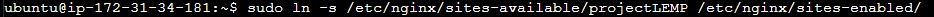

*Test your configuration for syntax errors*

`sudo nginx -t`

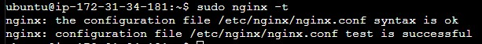

*Disable default Nginx host that is currently configured to listen on port 80*

`sudo unlink /etc/nginx/sites-enabled/default`

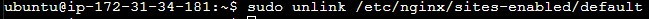

*Reload Nginx to apply the changes*

`sudo systemctl reload nginx`

*Create an index.html file in that location /var/www/projectLEMP*

`sudo echo 'Hello LEMP from hostname' $(curl -s http://169.254.169.254/latest/meta-data/public-hostname) 'with public IP' $(curl -s http://169.254.169.254/latest/meta-data/public-ipv4) > /var/www/projectLEMP/index.html`

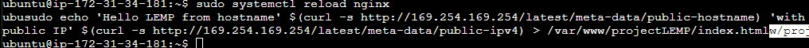

*On your browser, go to the website URL*

`http://<Public-IP-Address>:80`
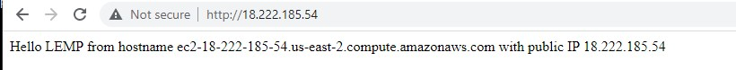

## Step 5

*Testing PHP with Nginx*

`sudo nano /var/www/projectLEMP/info.php`

*Paste the following lines*

`<?php
phpinfo();`

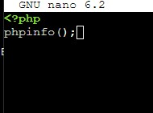

*Access the page via a browser*

`http://server_domain_or_IP/info.php`

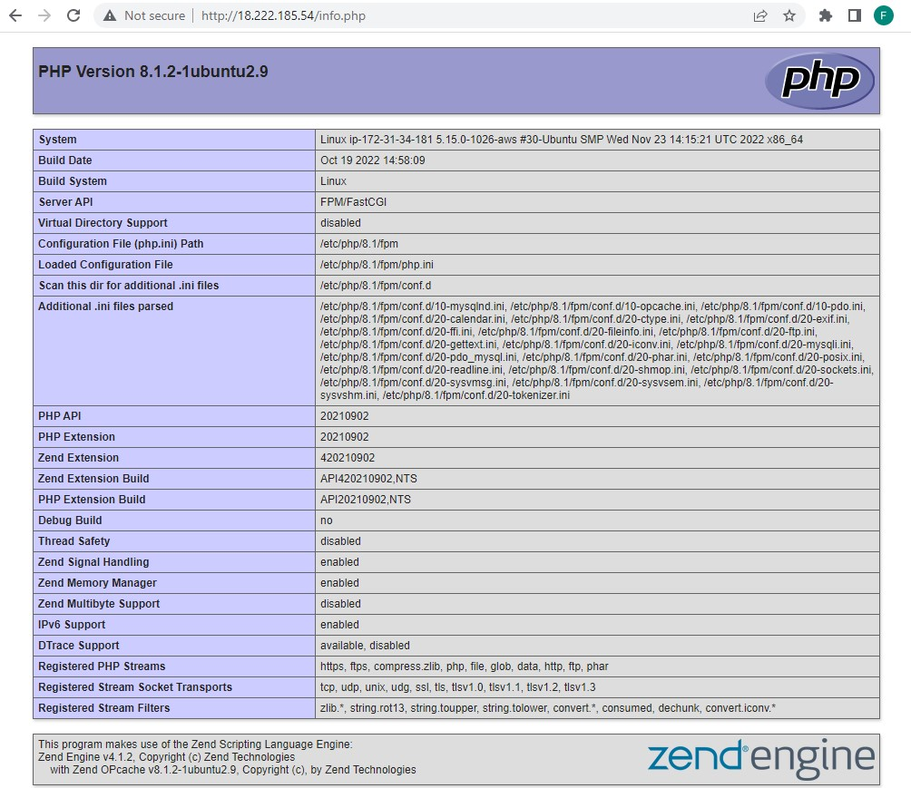

*Remove the file because it contains sensitive information*

`sudo rm /var/www/your_domain/info.php`

## Step 6 Retrieving data from MySQL database with PHP

*Connect to the MySQL console using the root account*

`sudo mysql`

*Create a new database from MySQL console*

`CREATE DATABASE `example_database`;`
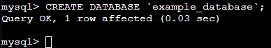

*creates a new user named example_user, using mysql_native_password as default*

`CREATE USER 'example_user'@'%' IDENTIFIED WITH mysql_native_password BY 'password';`

*Give this user permission over the example_database database, then exit*

`GRANT ALL ON example_database.* TO 'example_user'@'%';`

*Test new user's permissions*

`mysql -u example_user -p`

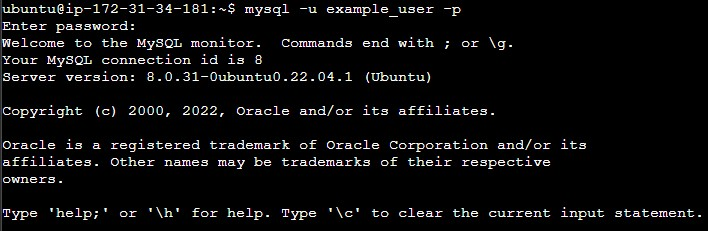

*Show databases*

`SHOW DATABASES;`

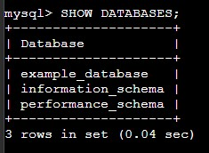

*Create a test table named todo_list*

`CREATE TABLE example_database.todo_list (
item_id INT AUTO_INCREMENT,
content VARCHAR(255),
PRIMARY KEY(item_id)
);`

*Insert a few rows of content in the test table*

 `INSERT INTO example_database.todo_list (content) VALUES ("My first important item");`

*Confirm that the data was successfully saved to the table, then exit*

 `SELECT * FROM example_database.todo_list;`
 `exit`

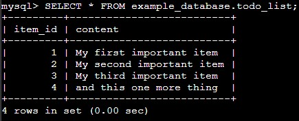

*Create a PHP script that will connect to MySQL and query for your content*

 `nano /var/www/projectLEMP/todo_list.php`

 

*Create a new PHP file in your custom web root directory, copy this content into your todo_list.php script, save and close*

`<?php`
`$user = "example_user";`
`$password = "password";`
`$database = "example_database";`
`$table = "todo_list";`

`try {`
  `$db = new PDO("mysql:host=localhost;dbname=$database", $user, ``$password);`
  `echo "<h2>TODO</h2><ol>";`
  `foreach($db->query("SELECT content FROM $table") as $row) {`
    `echo "<li>" . $row['content'] . "</li>";`
  `}`
  `echo "</ol>";`
`} catch (PDOException $e) {`
    `print "Error!: " . $e->getMessage() . " ";`
   `die();`
`}`

 

 *Access this page in your web browser by visiting the public ip address*

 `http://<Public_domain_or_IP>/todo_list.php`

